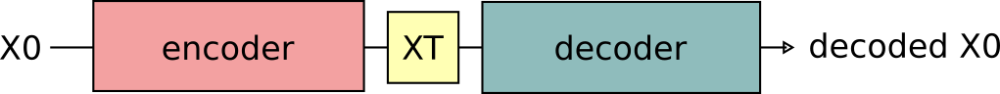

# Diffusion models 
A short review of diffusion models based on my understandings
Diffusion models are generative models, ie they try to imitate a distribution

## The markov chain

Take $X_0$ as a random variable indicating a sample from the dataset. This could be whatever as long as it's continuous. Take $u$ to be its distribution, our target is to construct a model in such a way that we can sample from a distribution that is similar to $u$

The diffusion process is a Markov chain that consists of a sequence of steps of the form 

$$ X_{t+1} =  \sqrt{1-\beta_t}* X_{t} + \sqrt{\beta_t} * \epsilon_t $$

With $\epsilon_t \sim N(0,I)$ and $\beta_t$ different constants that control how strong the change is.
This is known as the *forward diffusion process*. 
Now, it's easy to derive the posterior distribution of $X_{t+1}$ given the value of $X_{t} $. It's a gaussian that has been stretched and shifted

$$p(X_{t+1}| x_{t}) \sim N( \sqrt{1-\beta_t} * x_{t}, {\beta_t} * I)  $$

Taking it a step further, suppose $X_t$ follows some normal distribution when conditioned on $x_0$, ie $p(X_{t}| x_{0}) \sim N( \mu_t, {v_t} * I)  $

Then, given $x_0$,  $X_{t+1}$ is actually the linear combination of two gaussians and so the posterior distribution (that is, conditioned on $x_0$) is also gaussian with

$$p(X_{t+1}| x_{0}) \sim N( \sqrt{1-\beta_t} * \mu_t, {\beta_t + (1-\beta_t) * v_t} * I)  $$

Noting that $X_1|x_0$ is gaussian it then follows from induction that all  $X_t|x_0$  of the markov chain with $t>0$ are also gaussian with

$$ \mu_{t+1}  = \sqrt{1-\beta_t} * \mu_{t} $$

$$ {v_{t+1}} =  {\beta_t + (1-\beta_t) * v_t} $$

Using $\mu_0 = x_0, v_0 = 0$. (we are stretching a bit here using 0 variance gaussian as the $p(x_0|x_0)$ but this is just for easier notation, we could start from $x_1$, doesn't matter)

$$ \mu_{t+1}  = \sqrt{\prod^t{ (1-\beta_t)}} *x_0 $$

## Forward and backward process
The markov chain gives us a tuple of random variables $(X_0,X_1,...,X_T)$

With marginal distributions 

- $X_0 \sim u $
- $X_T \sim N(0,I)$

A cool way to see this is that the diffusion process gradually transforms the original distribution into the normal distribution. 

Now, to get the distribution we are interested in, we could take advantage that $X_T$ has a known distribution and use the conditional trajectory

```
Sample XT from Normal(0,I)
for t in T-1...0
    Sample Xt from p(Xt|X(t+1), X(t+2),...,XT)
Output X0
```

However, while **the forward distributions $X_t| X_{t-1}$ are simple gaussianss, the backward distributions $X_t| X_{t+1}, X_{t+2,...}$ are hard**


## The Diffusion models approach
The strategy can be seen as a VAE actually 




Suppose we had a model with parameters $\theta$ that, somehow, produces trajectories. That is, it produces $(\hat{X}_0,\hat{X}_1,...,\hat{X}_T)$

If we want to maximize the probability of generating the dataset we can go with the ELBO route.


