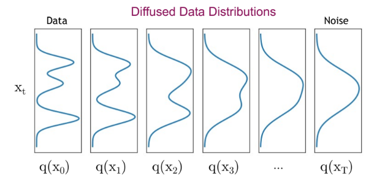
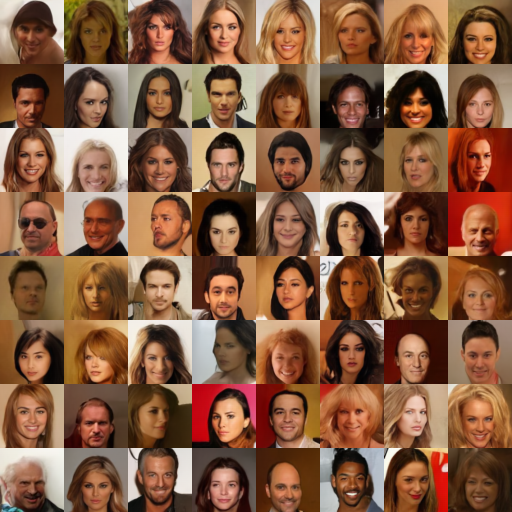

# Diffusion models 


A short review of diffusion models based on my understanding Diffusion models are generative models, ie they try to imitate a distribution

## The diffsuion markov chain

Take $X_0$ as a random variable indicating a sample from the dataset. This could be whatever as long as it's continuous. Take $u$ to be its distribution, our target is to construct a model in such a way that we can sample from a distribution that is similar to $u$

The diffusion process is a Markov chain that consists of a sequence of steps of the form 

$$ X_{t+1} =  \sqrt{1-\beta_t}* X_{t} + \sqrt{\beta_t} * \epsilon_t $$

With $\epsilon_t \sim N(0,I)$ and $\beta_t$ different constants that control how strong the change is.
This is known as the *forward diffusion process*. 
Now, it's easy to derive the posterior distribution of $X_{t+1}$ given the value of $X_{t} $. It's a gaussian that has been stretched and shifted

$$p(x_{t+1}| x_{t}) \sim N( \sqrt{1-\beta_t} * x_{t}, {\beta_t} * I)  $$

Taking it a step further, suppose $X_t$ follows some normal distribution when conditioned on $x_0$, ie $p(x_{t}| x_{0}) \sim N( \mu_t, {v_t} * I)  $

Then, given $x_0$,  $X_{t+1}$ is actually the linear combination of two gaussians and so the posterior distribution (that is, conditioned on $x_0$) is also gaussian with

$$p(x_{t+1}| x_{0}) \sim N( \sqrt{1-\beta_t} * \mu_t, {\beta_t + (1-\beta_t) * v_t} * I)  $$

Noting that $X_1|x_0$ is gaussian it then follows from induction that all  $X_t|x_0$  of the markov chain with $t>0$ are also gaussian with

$$ \mu_{t+1}  = \sqrt{1-\beta_t} * \mu_{t} $$

$$ {v_{t+1}} =  {\beta_t + (1-\beta_t) * v_t} $$

Using $\mu_0 = x_0, v_0 = 0$. (we are stretching a bit here using 0 variance gaussian as the $p(x_0|x_0)$ but this is just for easier notation, we could start from $x_1$, doesn't matter)

$$ \mu_{t+1}  = \sqrt{\prod^t{ (1-\beta_t)}} *x_0 $$

## Relevant notes on markov chains

### A time-reversed markov chain is also a markov chain

A short deviation to a relevant property that is not that obvious at first sight. Given a markov chain $A_1, A_2, A_3... A_k$. *The reversed process also has the Markov property*.  That is

$$ p(a_c | a_{c+1},a_{c+2}...a_{k}) = p(a_c | a_{c+1}) $$

The future is independent of the past given the present but it also goes the other direction. The past is independent of the future given the present.

Proof by induction on k

$$ p(a_c | a_{c+1:k}) = \frac{ p(a_{c:k})}{p(a_{c+1:k})}   $$

$$ = \frac{  p(a_{k}| a_{c:k-1} ) p(a_{c:k-1}) }{p(a_{c+1:k})}   $$

$$ = \frac{  p(a_{k}| a_{c:k-1} ) p(a_{c:k-1}) }{p(a_{k}| a_{c+1:k-1} ) p(a_{c+1:k-1})}   $$

By the markov propety 

$$ = \frac{  p(a_{k}| a_{k-1} ) p(a_{c:k-1}) }{p(a_{k}| a_{k-1} ) p(a_{c+1:k-1})} =  \frac{  p(a_{c:k-1}) }{ p(a_{c+1:k-1})} = p(a_c | a_{c+1:k-1}) $$

And so $p(a_c | a_{c+1:k})= p(a_c | a_{c+1}) \blacksquare$

### Conditioning a markov chain from both sides 
The markov property indicates that the future is independent of the past given the present. However, it is not necessarily independent of a further future even when knowing the present.

This property might be easier to grasp with a simple example. Take the markov chain

$$A_1  \rightarrow A_2 \rightarrow A_3 \rightarrow A_4$$

With dynamics given by
- $A_1 \sim N(0,I) $
- $A_2 = A_1$
- $A_3|A_2 \sim N(0,I)$
- $A_4 = A_3$

That is, this markov chain copies the random variable from step 1 to step 2 and from step 3 to step 4. Step 3 is independent of what happened before.

Clearly, $p(A_3|A_2) \neq p(A_3|A_2, A_4)$. Knowing $A_4$ tells you everything about $A_3$, but $A_2$ has no information about $A_3$ at all.

The same reasoning, by symmetry, applies to the backward direction $p(A_2|A_3) \neq p(A_2|A_3, A_1)$.

So, in general, when random variables in a markov chain are given the "boundary conditions" for some past and some future, they are independent of what happens before or after that boundary

## Forward and backward diffsuion chains
The markov chain gives us a tuple of random variables $(X_0,X_1,...,X_T)$ with marginal distributions such that

- $X_0 \sim u $
- $X_T \sim N(0,I)$

A cool way to see this is that the diffusion process gradually transforms the original distribution into the normal distribution. 




Now, to get the distribution we are interested in, we could take advantage that $X_T$ has a known distribution and use the conditional trajectory

```
Sample XT from Normal(0,I)
for t in T-1...0
    Sample Xt from p(Xt|X(t+1))
Output X0
```

However, while **the forward distributions $x_t| x_{t-1}$ are simple gaussianss, the backward distributions $x_t| x_{t+1}$ are hard**


## The Diffusion models approach

The end goal is to have a model that can approximate the backward dynamics $p_\theta(x_t|x_{t+1})$ so that we can replace that in our pseudo algorithm

The strategy can be seen as a VAE with a "dumb" encoder actually (non-parametrized)


Let's forget about that for now. Suppose we had some backward markov model with parameters $\theta$ that produces trajectories. That is, it generates $(\hat{X}_0,\hat{X}_1,...,\hat{X}_T)$ sammpling $\hat{X}_T$ from $N(0,I)$. We are not concerned with this model mimicking the backward dynamics of the original markov chain.


We'd like our backward markov model to learn to generate the samples. That is $p_\theta(x_0) \simeq p(x_0)$.

Our proxy for learning this, as usual, is going to be the log-likelihood. Using the ELBO we have 

$$\log p_\theta(x_{0}) \geq E_{X_{1:T}|x_0} \left[\log \frac{p_\theta(x_0, X_{1:T})}{p(X_{1:T}|x_0)} \right]$$

We can expand both the true markov chain and our parametrized one using the (backward) markov property

- $p_\theta(x_0, X_{1:T}) = p_\theta(x_0|X_1) ( \prod_{t=1:T-1} p_\theta(X_t|X_{t+1}) ) p_\theta(X_T)$

- $p(X_{1:T}|x_0)=  ( \prod{t=1:T-1} p(X_t|X_{t+1}, x_0) ) p(X_T|x_0)$


Note that the products start at $t=1$ because $x_0$ is not a random variable. It's fixed, so we handle it slightly different


Then we use the log to change the product into a sum


$$= E_{ X_{1:T}|x_0} \left[ \left( \sum{t=1:T-1} \log \frac{p_\theta(X_t|X_{t+1})} {p(X_t|X_{t+1},x_0)} \right) + \log \frac{ p_\theta(X_T)}{ p(X_T|x_0)}  + \log p_\theta(x_0|X_1)  \right]$$


Note that, we always have that $X_T \sim N(0,I)$, it does not depend on $\theta$ nor on $x_0$. So the second term is 0. The first term is also a sum of KL divergences

$$=   \left( \sum_{t=1:T-1} -KL\left(p(X_t|X_{t+1},x_0) \mid \mid p_\theta(X_t|X_{t+1})\right)  \right)   + E_{ X_1|x_0} \left[ \log p_\theta(x_0|X_1)  \right]$$


## Is the model actually learning the backward dynamics?
Add $X_0$ to the expectation to make this a lower bound on the log-likelihood of generating the dataset. That is, our target is


$$L =  E_{X_{0:T}} \left[\log \frac{p_\theta(X_{0:T})}{p(X_{1:T}|X_0)} \right]$$


Let's redo the development of the last section but using 

- $$p(X_{1:T}|X_0)=  \frac{p(X_{0:T})} { p(X_0)} =  \prod_{t=0:T-1} p(X_t|X_{t+1}) \frac{p(X_T)}{ p(X_0)}$$


Which leads to 

$$L = E_{ X_{0:T}} \left[ \left( \sum_{t=0:T-1} \log \frac{p_\theta(X_t|X_{t+1})}{p(X_t|X_{t+1})} \right) + \log \frac { p_\theta(X_T)} { p(X_T)} - \log p(X_0)  \right]$$

$$=   \left( \sum_{t=0:T-1} -KL\left(p(X_t|X_{t+1}) \mid \mid p_\theta(X_t|X_{t+1})\right)  \right) + 0 + H(X_0)$$

**So we are truly learning the markov model backward dynamics!**


## The $x_t|x_{t+1},x_0$ distribution is gaussian


## How do we even sample such a thing?
Suppose we effectively train the model. How are we going to actually sample it?


Well, it's a markov model so once we have a trained model, as long as $p_\theta(x_{t+1}|x_t)$ is easy to sample we are good.


## On why there is a square root on the markov equation

A bit odd thing to notice is that $x_t$ follows

$$ x_t = \sqrt{\hat{\alpha_t}} x_0 + \sqrt{1 - \hat{\alpha_t}} \epsilon  $$

Why are there square roots in there?

A helpful insight is that this preserves variance.

$$ Var(X_t) = \hat{\alpha_t} Var(X_0) + (1-\hat{\alpha_t}) $$

Assuming $Var(X_0) = 1$ we get 

$$ Var(X_t) = \hat{\alpha_t}  + (1-\hat{\alpha_t}) = 1$$

If we where to remove the square root and simply do 

$$  {\hat{\alpha_t}} x_0 + {1 - \hat{\alpha_t}} \epsilon  $$

We would get a variance 

$$ \hat{\alpha_t}^2  + (1-\hat{\alpha_t})^2 = 2 \hat{\alpha_t} (\hat{\alpha_t}-1) + 1 $$

Which would vary as you advance in the markov chain. It would have less variance between the extremes. How exactly? It depends on the specific schedule we use. 

## Generating faces 
Samples generated with **our trained model**. They are OK!



Here is a video of a diffusion process


https://github.com/mgp123/diffusion-learning/assets/43388395/c89d1e78-22e7-44b6-9f70-4520916a47e6


## Conditioning example. Super resolution

You can also do conditional generation. For simple image conditional generation you can simply add some extra info somewhere in the neural network. In this example, we add 3 extra channels to the input with some low-resolution version of the denoised image.
This trick is also a good idea when you want training at high resolution is not feasible due to compute limitations. We can train a large model for a lower resolution and then a smaller model for a higher resolution (64x64 and 128x128 respectively this case)

Below our current trained example (its pretty bad right now)


## Training the models yourself

**Run the script** with the command `python src/train.py`.

The script is structured to initialize the model with specified hyperparameters. You can define your model's hyperparameters in the `model_hyperparameters` dictionary. This includes settings such as the number of blocks, channels, and timesteps for the diffusion process.

The model consists of a simple U-Net with residual connections. Contrary to popular implementations, we feed the variance of the diffusion step directly to the model instead of the timestep itself.

*Optional Model Loading*. If you wish to continue training from a pre-trained model, set the conditional statement to `True` and specify the path to your `.pth` file containing the model weights and hyperparameters.

*TensorBoard logging* losses. This allows for real-time monitoring of the model's performance. To view these logs, run `tensorboard --logdir=runs` from your terminal.

*Image Saving* at specified intervals, the script saves generated images to a designated directory. Ensure to set the `sample_every` variable to control how frequently images are saved during training.


## References
- Denoising Diffusion Probabilistic Models. *Jonathan Ho, Ajay Jain, Pieter Abbeel*. [Paper](https://arxiv.org/abs/2006.11239)
- https://lilianweng.github.io/posts/2021-07-11-diffusion-models/ 
- Denoising Diffusion-based Generative Modeling: Foundations and Applications. *Karsten Kreis Ruiqi Gao Arash Vahdat*. [Link](https://cvpr2022-tutorial-diffusion-models.github.io/). This is a *really good one*

